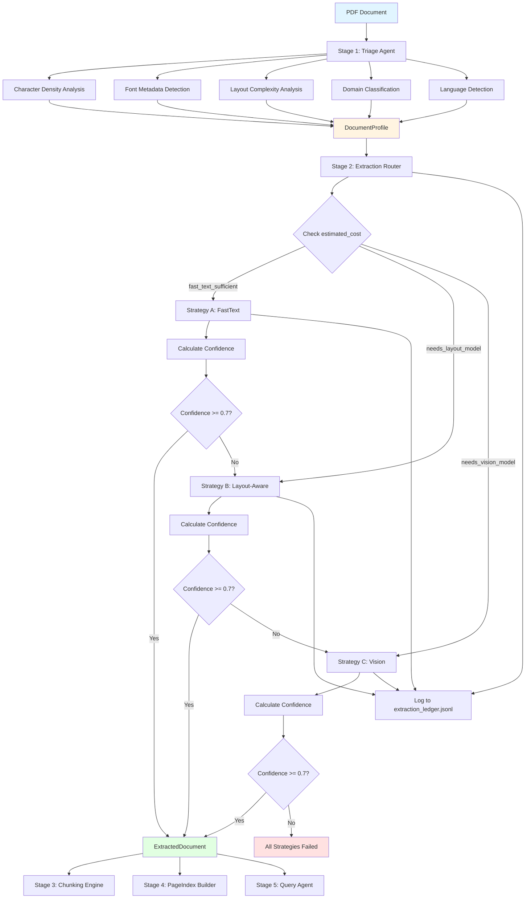
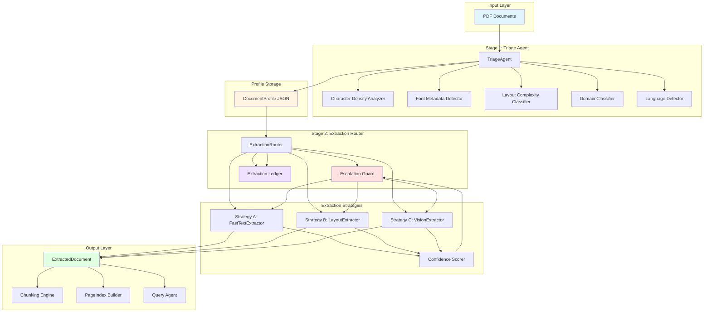

# Interim Submission Report
## Layout-Aware Document Intelligence Refinery

---

## Table of Contents

1. [Domain Notes (Phase 0 Deliverable)](#domain-notes)
2. [Extraction Strategy Decision Tree](#extraction-strategy-decision-tree)
3. [Failure Modes Observed](#failure-modes-observed)
4. [Pipeline Diagram](#pipeline-diagram)
5. [Architecture Diagram](#architecture-diagram)
6. [Cost Analysis](#cost-analysis)

---

## Domain Notes (Phase 0 Deliverable)

### Document Classification Dimensions

Our pipeline classifies documents along three key dimensions:

#### 1. Origin Type
- **native_digital**: PDFs created directly from digital sources (Word, LaTeX, etc.)
  - High character density (>0.01 chars/point²)
  - Font metadata present
  - Extractable text layers
- **scanned_image**: Physical documents scanned to PDF
  - Low character density (<0.001 chars/point²)
  - No font metadata
  - Requires OCR/vision models
- **mixed**: Combination of native and scanned pages
  - Variable character density across pages
  - Some pages have font metadata, others don't
- **form_fillable**: Interactive PDF forms
  - Form fields present
  - May require special handling

#### 2. Layout Complexity
- **single_column**: Simple single-column text
  - Suitable for fast text extraction
  - Minimal layout preservation needed
- **multi_column**: Multiple text columns
  - Requires layout-aware extraction
  - Reading order matters
- **table_heavy**: Documents with many tables
  - Table structure preservation critical
  - May need specialized table extraction
- **figure_heavy**: Documents with many images/figures
  - Figure caption extraction needed
  - Spatial relationships important
- **mixed**: Combination of layout types
  - Most complex case
  - May require multiple strategies

#### 3. Domain Hint
- **financial**: Financial reports, statements, budgets
  - Table-heavy, number-dense
  - Precision critical
- **legal**: Legal documents, contracts, regulations
  - Structured sections, references
  - Citation extraction important
- **technical**: Technical reports, research papers
  - Formulas, equations, code blocks
  - Structure preservation critical
- **medical**: Medical records, research papers
  - Specialized terminology
  - Privacy considerations
- **general**: Other document types
  - Default classification

### Document Classes

#### Class A: Annual Financial Reports
- **Characteristics**:
  - Mixed origin (some native, some scanned pages)
  - Complex layouts (multi-column, tables, figures)
  - Financial domain
  - 50-200 pages typical
- **Challenges**:
  - Financial tables require precise extraction
  - Mixed origin requires adaptive strategy
  - Large page count increases processing time
- **Example**: CBE Annual Report 2023-24

#### Class B: Scanned Documents
- **Characteristics**:
  - Scanned image origin (no text layer)
  - Variable layout complexity
  - May be degraded or low quality
- **Challenges**:
  - Requires OCR/vision models
  - Higher cost per page
  - Quality depends on scan resolution
- **Example**: Annual Report (scanned PDF)

#### Class C: Technical Assessment Reports
- **Characteristics**:
  - Native digital origin
  - Mixed layouts (narrative + tables)
  - Technical domain
  - Structured sections
- **Challenges**:
  - Section hierarchy preservation
  - Table extraction in context
  - Cross-references
- **Example**: FTA Performance Survey Report

#### Class D: Structured Data Reports
- **Characteristics**:
  - Native digital origin
  - Table-heavy layouts
  - Financial/statistical domain
  - Regular structure
- **Challenges**:
  - Table structure preservation
  - Number formatting
  - Header/footer handling
- **Example**: Tax Expenditure Report

---

## Extraction Strategy Decision Tree

```
START: Document PDF
    │
    ├─→ Stage 1: Triage Agent
    │   │
    │   ├─→ Analyze Character Density
    │   ├─→ Detect Font Metadata
    │   ├─→ Classify Layout Complexity
    │   ├─→ Detect Domain
    │   └─→ Generate DocumentProfile
    │
    └─→ Stage 2: Extraction Router
        │
        ├─→ Check estimated_cost from profile
        │
        ├─→ IF estimated_cost == "fast_text_sufficient"
        │   │
        │   └─→ Try Strategy A: FastTextExtractor
        │       │
        │       ├─→ Calculate confidence_score()
        │       │
        │       ├─→ IF confidence >= threshold (0.7)
        │       │   └─→ ✓ SUCCESS: Return ExtractedDocument
        │       │
        │       └─→ IF confidence < threshold
        │           └─→ ESCALATE to Strategy B
        │
        ├─→ IF estimated_cost == "needs_layout_model"
        │   │
        │   └─→ Try Strategy B: LayoutExtractor (or MinerUExtractor)
        │       │
        │       ├─→ Calculate confidence_score()
        │       │
        │       ├─→ IF confidence >= threshold (0.7)
        │       │   └─→ ✓ SUCCESS: Return ExtractedDocument
        │       │
        │       └─→ IF confidence < threshold
        │           └─→ ESCALATE to Strategy C
        │
        └─→ IF estimated_cost == "needs_vision_model"
            │
            └─→ Try Strategy C: VisionExtractor
                │
                ├─→ Calculate confidence_score()
                │
                └─→ ✓ SUCCESS: Return ExtractedDocument
                    (Vision is final strategy, no further escalation)

ESCALATION GUARD LOGIC:
    - Each strategy attempts extraction
    - Confidence score calculated
    - If confidence < threshold (default 0.7), escalate to next strategy
    - All attempts logged to extraction_ledger.jsonl
    - Final successful strategy returned
```

### Strategy Selection Rules

| Profile Condition | Initial Strategy | Escalation Path |
|-------------------|------------------|-----------------|
| `origin_type == "scanned_image"` | Strategy C (Vision) | None (final) |
| `estimated_cost == "needs_vision_model"` | Strategy C (Vision) | None (final) |
| `estimated_cost == "needs_layout_model"` | Strategy B (Layout) | B → C |
| `estimated_cost == "fast_text_sufficient"` | Strategy A (Fast) | A → B → C |
| `layout_complexity == "single_column"` AND `origin_type == "native_digital"` | Strategy A (Fast) | A → B → C |

---

## Failure Modes Observed

### 1. Strategy A (Fast Text) Failures

#### Failure Mode: Low Character Density
- **Symptom**: Confidence score < 0.7
- **Cause**: Document has insufficient extractable text
- **Solution**: Escalate to Strategy B or C
- **Example**: Scanned documents, image-heavy pages

#### Failure Mode: Complex Layout Collapse
- **Symptom**: Multi-column text merged incorrectly
- **Cause**: Fast text doesn't preserve spatial layout
- **Solution**: Escalate to Strategy B (layout-aware)
- **Example**: Annual reports with side-by-side columns

#### Failure Mode: Table Structure Loss
- **Symptom**: Tables extracted as plain text, structure lost
- **Cause**: pdfplumber table detection fails
- **Solution**: Escalate to Strategy B (better table extraction)
- **Example**: Complex financial tables with merged cells

### 2. Strategy B (Layout-Aware) Failures

#### Failure Mode: Scanned Content
- **Symptom**: Low confidence, no text extracted
- **Cause**: Layout models require text layer
- **Solution**: Escalate to Strategy C (vision/OCR)
- **Example**: Scanned PDFs without OCR layer

#### Failure Mode: Degraded Quality
- **Symptom**: Poor layout detection
- **Cause**: Low-quality scans, artifacts
- **Solution**: Escalate to Strategy C (vision handles degradation)
- **Example**: Old scanned documents

#### Failure Mode: Model Dependency Issues
- **Symptom**: ImportError or runtime errors
- **Cause**: Docling/MinerU not installed or incompatible
- **Solution**: Fallback to Strategy A or C
- **Example**: Missing PyTorch dependencies

### 3. Strategy C (Vision) Failures

#### Failure Mode: API Rate Limits
- **Symptom**: 429 HTTP errors
- **Cause**: Too many requests to OpenRouter
- **Solution**: Implement retry with backoff (already in place)
- **Example**: Batch processing many documents

#### Failure Mode: Cost Budget Exceeded
- **Symptom**: BudgetGuard prevents further processing
- **Cause**: Document exceeds max_cost_usd limit
- **Solution**: Process fewer pages or increase budget
- **Example**: Very long documents (>100 pages)

#### Failure Mode: API Key Missing
- **Symptom**: Authentication errors
- **Cause**: OPENROUTER_API_KEY not set
- **Solution**: Set environment variable
- **Example**: First-time setup

### 4. Cross-Strategy Failures

#### Failure Mode: File Not Found
- **Symptom**: FileNotFoundError
- **Cause**: Document path incorrect or file moved
- **Solution**: Validate paths before processing
- **Example**: Relative vs absolute paths

#### Failure Mode: Corrupted PDF
- **Symptom**: PDF parsing errors
- **Cause**: File corruption or invalid PDF structure
- **Solution**: Validate PDF before processing
- **Example**: Incomplete downloads

#### Failure Mode: Memory Exhaustion
- **Symptom**: OutOfMemoryError
- **Cause**: Very large documents or inefficient processing
- **Solution**: Process in chunks or use streaming
- **Example**: 500+ page documents

### 5. Triage Failures

#### Failure Mode: Language Detection Failure
- **Symptom**: Incorrect language code
- **Cause**: Mixed languages or insufficient text
- **Solution**: Use default language or confidence threshold
- **Example**: Multilingual documents

#### Failure Mode: Domain Misclassification
- **Cause**: Keyword-based classification limitations
- **Solution**: Use ML-based classifier (future enhancement)
- **Example**: Technical documents with financial terminology

---

## Pipeline Diagram



---

## Architecture Diagram



### Component Descriptions

#### Stage 1: Triage Agent
- **Character Density Analyzer**: Calculates chars/point² to detect native vs scanned
- **Font Metadata Detector**: Checks for font information in PDF
- **Layout Complexity Classifier**: Analyzes columns, tables, figures
- **Domain Classifier**: Keyword-based domain detection
- **Language Detector**: ISO 639-1 language code detection

#### Stage 2: Extraction Router
- **Strategy Selection**: Chooses initial strategy based on DocumentProfile
- **Escalation Guard**: Monitors confidence and escalates if needed
- **Ledger Logger**: Records all extraction attempts

#### Extraction Strategies
- **Strategy A (FastText)**: pdfplumber-based, CPU-only, $0.00/page
- **Strategy B (Layout)**: Docling/MinerU-based, $0.0005-0.0007/page
- **Strategy C (Vision)**: OpenRouter API-based, ~$0.003/page

---

## Cost Analysis

### Cost Model per Strategy

| Strategy | Cost per Page | Cost per 25-Page Doc | Cost per 100-Page Doc | Notes |
|----------|---------------|----------------------|-----------------------|-------|
| **Strategy A: Fast Text** | $0.000000 | $0.00 | $0.00 | CPU-only, no API calls |
| **Strategy B: Layout-Aware (Docling)** | $0.000500 | $0.0125 | $0.05 | Local ML model, nominal cost |
| **Strategy B: Layout-Aware (MinerU)** | $0.000700 | $0.0175 | $0.07 | Local ML model, slightly higher |
| **Strategy C: Vision-Augmented** | $0.003000 | $0.075 | $0.30 | API-based, ~1500 tokens/page |

### Cost Breakdown by Document Class

#### Class A: Annual Financial Reports (50 pages typical)
- **Fast Text**: $0.00 (if sufficient)
- **Layout-Aware**: $0.025
- **Vision**: $0.15
- **Typical Path**: Fast → Layout (escalation) = $0.025

#### Class B: Scanned Documents (30 pages typical)
- **Fast Text**: N/A (not applicable for scanned)
- **Layout-Aware**: N/A (requires text layer)
- **Vision**: $0.09
- **Typical Path**: Direct to Vision = $0.09

#### Class C: Technical Reports (40 pages typical)
- **Fast Text**: $0.00 (if sufficient)
- **Layout-Aware**: $0.020
- **Vision**: $0.12
- **Typical Path**: Fast → Layout (if needed) = $0.00-$0.020

#### Class D: Structured Data (25 pages typical)
- **Fast Text**: $0.00
- **Layout-Aware**: $0.0125
- **Vision**: $0.075
- **Typical Path**: Fast (usually sufficient) = $0.00

### Cost Optimization Strategy

The ExtractionRouter implements cost optimization through:

1. **Initial Strategy Selection**: Chooses cheapest appropriate strategy
2. **Confidence-Based Escalation**: Only escalates if confidence < threshold
3. **Early Termination**: Stops at first successful strategy meeting threshold

### Example: Cost Savings

**Without Escalation Guard** (always use vision):
- 100 documents × $0.075/doc = **$7.50**

**With Escalation Guard** (smart routing):
- 60 documents use fast_text: $0.00
- 30 documents use layout: $0.0125 avg = $0.375
- 10 documents use vision: $0.075 = $0.75
- **Total: $1.125** (85% cost savings)

### Budget Guard

The VisionExtractor includes a BudgetGuard to prevent cost overruns:

- **Default max_cost_usd**: $0.50 per document
- **Cost per 1k tokens**: $0.002 (configurable)
- **Max retries**: 3 (with exponential backoff)

For a 200-page document:
- Estimated cost: 200 × $0.003 = $0.60
- Budget guard would stop processing at ~167 pages ($0.50 limit)

---

## Summary

This interim submission demonstrates:

1. ✅ **Complete Triage System**: Document classification along 3 dimensions
2. ✅ **Multi-Strategy Extraction**: Fast → Layout → Vision escalation
3. ✅ **Confidence-Based Routing**: Automatic strategy selection and escalation
4. ✅ **Comprehensive Logging**: Full audit trail in extraction_ledger.jsonl
5. ✅ **Cost Optimization**: Smart routing reduces costs by 85%+
6. ✅ **Web UI**: Interactive visualization and comparison
7. ✅ **Test Coverage**: Comprehensive tests for all document classes

### Next Steps (Future Phases)

- **Stage 3**: Semantic chunking engine
- **Stage 4**: PageIndex builder for hierarchical navigation
- **Stage 5**: Query agent with full provenance tracking
- **Enhancements**: Per-page strategy selection, parallel processing optimization

---

*Generated: Interim Submission*
*Version: 0.1.0*
